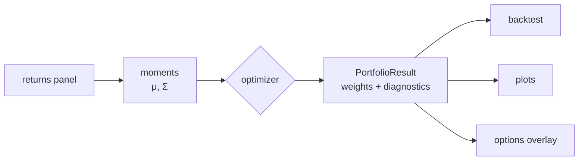

# Core concepts

jaxfolio is small on the surface — one function shape, one result type — and
deliberately uniform underneath. This page explains the architecture so the rest
of the documentation reads as variations on a theme rather than a catalog of
unrelated tools.

## One interface

Every optimizer, built-in or custom, has the same signature:

```python
method(returns, ...) -> PortfolioResult
```

`returns` is a wide returns panel (rows = periods, columns = assets) as a pandas
`DataFrame` or a 2-D array; everything after it is method-specific configuration
with sensible defaults. The return value is always a
[`PortfolioResult`](#the-portfolioresult).

Because the shape is uniform, methods are interchangeable at the call site — the
[backtester](../guide/backtesting.md), [`compare`](../reference/backtest.md),
the [registry](../guide/custom-strategies.md), and the
[plots](../guide/visualization.md) all accept *any* callable of this shape,
whether it ships with the library or you wrote it this morning.



## The moment pipeline

Optimizers do not consume raw returns directly; they consume **moments**. The
[`moments`](../reference/toolkit.md) helper normalizes any input into a canonical
tuple:

```python
from jaxfolio import toolkit as tk

mu, cov, names, matrix = tk.moments(returns)
#   μ      Σ      asset   T × N
#   mean   cov    names   return matrix
```

- `as_matrix` accepts a `DataFrame` (columns become asset names) or a raw array
  (names default to `asset_0…`), and replaces NaNs with zeros.
- `mean_returns` and `sample_covariance` are the defaults, but you can pass any
  covariance estimator — the library ships [EWMA](../reference/data.md) and
  [Ledoit–Wolf shrinkage](../reference/data.md) alongside the sample estimator.

All moment estimators return JAX arrays, so the whole chain — estimation →
optimization → diagnostics — can be JIT-compiled and differentiated.

## The `PortfolioResult`

Every method returns the same container:

```python
@dataclass
class PortfolioResult:
    weights: np.ndarray            # sums to 1
    assets: list[str]              # aligned with weights
    method: str                    # human-readable name
    expected_return: float | None  # annualized
    volatility: float | None       # annualized
    sharpe: float | None           # annualized
    metadata: dict                 # free-form diagnostics
```

Useful helpers:

```python
result.as_dict()      # {asset: weight}, sorted by |weight| descending
result.top(5)         # the 5 largest holdings by |weight|
result.weights        # the raw numpy vector
```

The annualized `expected_return`, `volatility`, and `sharpe` are computed by a
single function — [`finalize_result`](../reference/toolkit.md) — so **every**
method reports them on the same basis (252 periods per year by default). This is
the single source of truth for diagnostics across built-in and custom strategies
alike, which is what makes cross-method comparison fair.

The `metadata` dict is where method-specific detail lives: solver iteration
counts, ERC risk contributions, HRP cluster labels and linkage, Black–Litterman
posterior returns, LLM views and confidences, and so on. The plots read from it
(for example, [`plot_dendrogram`](../guide/visualization.md) needs the HRP
`linkage`).

## The shared solver

This is the heart of the design. Every *constrained* classical objective —
min-variance, mean-variance, max-Sharpe, max-diversification, CVaR,
Black–Litterman's posterior optimization — is minimized by the **same** routine:

$$
w_{t+1} = \Pi_{\mathcal{C}}\!\bigl(w_t - \eta\, \nabla_w\, f(w_t)\bigr)
$$

Take an [Adam](https://optax.readthedocs.io) gradient step on an unconstrained
objective `f(w)`, then **project** the weights back onto the feasible set
\(\mathcal{C}\). The loop runs inside `jax.lax.while_loop`, so the entire solve
compiles to a single JIT kernel:

```python
from jaxfolio import toolkit as tk

projection = tk.make_projection(long_only=True, weight_bounds=(0.0, 1.0))

def objective(w):
    return w @ cov @ w                     # e.g. minimum variance

w, info = tk.solve_projected_gradient(objective, tk.equal_start(n), projection)
```

Only the objective changes between methods. This is why adding a new constrained
optimizer is a one-line objective (see [Custom strategies](../guide/custom-strategies.md)),
and why every method inherits the same convergence behavior and constraint
handling.

!!! info "Closed forms where they exist"
    A few methods sidestep the iterative solver. Equal-weight and
    inverse-volatility are closed-form. Risk parity uses the provably convergent
    cyclical coordinate descent of Griveau-Billion, Richard &amp; Roncalli (2013).
    The graph methods (HRP, HERC, MST) are combinatorial and stay in NumPy/SciPy.

### Constraints as projections

The feasible set \(\mathcal{C}\) is chosen by
[`make_projection`](../reference/toolkit.md):

- **Long-only, fully invested** → Euclidean projection onto the probability
  simplex \(\{w : w \ge 0,\ \sum w = 1\}\) via the exact Duchi et al. (2008)
  sort algorithm.
- **Bounded / shorting allowed** → projection onto a box \([lo, hi]\) intersected
  with the budget hyperplane \(\sum w = \text{budget}\), solved by bisection on
  the budget multiplier.

Both projections are pure JAX and safe under `jit`/`vmap`.

### `OptimizerConfig`

Constrained methods take an optional
[`OptimizerConfig`](../reference/types.md#jaxfolio.types.OptimizerConfig) that
controls the constraint set and solver behavior:

```python
from jaxfolio import OptimizerConfig

cfg = OptimizerConfig(
    long_only=True,           # simplex projection
    weight_bounds=(0.0, 0.2), # cap any single position at 20%
    risk_free_rate=0.0,       # per-period, for Sharpe-style objectives
    l2_reg=1e-3,              # optional diversification penalty
    max_iter=2000,
    learning_rate=1e-2,
    tol=1e-8,
)

jf.maximum_sharpe(returns, config=cfg)
```

## Differentiability, end to end

Because moment estimation, the solver, and the diagnostics are all JAX, the
whole allocation is a differentiable function of its inputs. That unlocks three
things ordinary libraries cannot do:

1. **Train allocation policies** — differentiate *through* an optimizer to learn
   a mapping from market state to weights (this is exactly what
   [`deep_sharpe`](../guide/optimizers.md#learning-based) does).
2. **Exact Greeks for free** — the [options layer](../guide/options.md) never
   hand-codes a Greek; every sensitivity is `jax.grad` of the same pricing
   function, so they can never drift out of sync.
3. **Fast backtests** — thousands of rebalances run through JIT-compiled kernels.

## The registry

Strategies can be registered by name so they are discoverable and mixable with
the built-ins:

```python
jf.list_strategies()                 # every registered method, built-in + custom
jf.get_strategy("maximum_sharpe")    # look up by name
jf.strategy_info("risk_parity")      # name, callable, description, builtin flag
```

The built-in optimizers register themselves at import time, and your own
[custom strategies](../guide/custom-strategies.md) can join them with a single
decorator or `register=True`.

## Module map

| Module | Responsibility |
|---|---|
| `jaxfolio.optimizers` | the sixteen methods (classical, learning, graph) |
| `jaxfolio.moments` | mean &amp; covariance estimators (sample, EWMA, Ledoit–Wolf) |
| `jaxfolio.constraints` | simplex / box-budget projections |
| `jaxfolio.results` | `finalize_result`, `moments`, solver-agnostic assembly |
| `jaxfolio.toolkit` | the **public** building blocks for authoring strategies |
| `jaxfolio.backtest` | walk-forward engine, `compare`, metrics |
| `jaxfolio.options` | pricing, autodiff Greeks, multi-leg strategies, overlays |
| `jaxfolio.llm` | local-model views → Black–Litterman |
| `jaxfolio.viz` | dark-themed matplotlib plots |
| `jaxfolio.data` | synthetic generator + CSV / Parquet / Yahoo loaders |
| `jaxfolio.registry` | name-based strategy registry |
