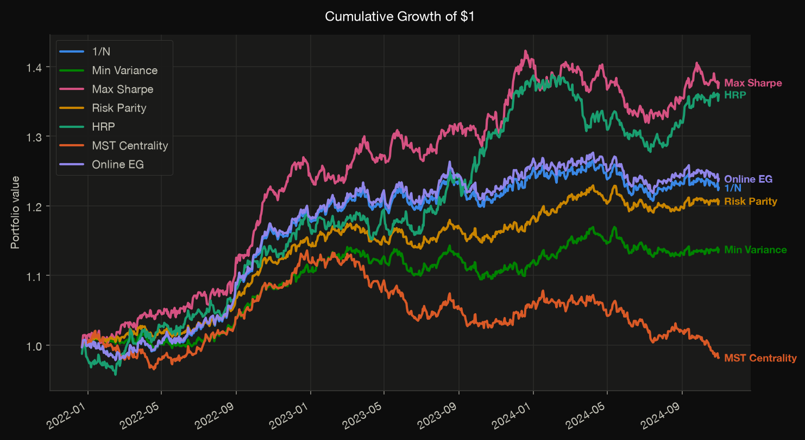

# Backtesting

The backtester is a **vectorized walk-forward engine** that is completely
optimizer-agnostic: it accepts any callable `optimizer(window) → PortfolioResult`
— built-in, custom, or a partially-applied variant — rebalances on a fixed
schedule, applies linear transaction costs on turnover, and lets weights drift
with returns between rebalances.

## How the walk-forward works

At each step \(t\) beyond the initial `lookback`:

1. **Rebalance** (every `rebalance_every` periods): hand the trailing `lookback`
   window to the optimizer, align its weights to the panel's asset order, and
   charge `transaction_cost × turnover`, where turnover is the \(\ell_1\) change
   \(\sum_i |w^{\text{target}}_i - w^{\text{current}}_i|\).
2. **Accrue** the period return net of any cost: \(r^{\text{strat}}_t = w^\top r_t - \text{cost}\).
3. **Drift** the weights with realized returns between rebalances (buy-and-hold),
   renormalizing so they continue to sum to one.

This avoids look-ahead bias — the optimizer only ever sees data strictly before
the period it is allocating for.

## Single backtest

```python
from jaxfolio.backtest import backtest
import jaxfolio as jf

returns = jf.generate_returns(n_assets=12, n_days=1000, seed=11)

result = backtest(
    returns,
    jf.maximum_sharpe,
    name="Max Sharpe",
    lookback=252,            # trailing window handed to the optimizer
    rebalance_every=21,      # ≈ monthly for daily data
    transaction_cost=0.0010, # 10 bps per unit of one-way turnover
    risk_free=0.0,
)
```

[`backtest`](../reference/backtest.md#jaxfolio.backtest.engine.backtest) returns a
[`BacktestResult`](../reference/backtest.md#jaxfolio.backtest.engine.BacktestResult)
holding the net-of-cost return series, the full weight history, turnover, and a
metrics summary:

```python
result.returns          # pd.Series of net strategy returns
result.weights          # pd.DataFrame — dates × assets
result.turnover         # pd.Series
result.metrics          # dict of headline metrics
result.equity_curve     # cumulative growth of $1
result.drawdown         # underwater curve
```

## Comparing several strategies

[`compare`](../reference/backtest.md#jaxfolio.backtest.engine.compare) runs the
same backtest across a `{name: optimizer}` map (all keyword arguments are
forwarded), and [`metrics_table`](../reference/backtest.md#jaxfolio.backtest.engine.metrics_table)
assembles a tidy comparison frame:

```python
from jaxfolio.backtest import compare, metrics_table

results = compare(returns, {
    "1/N":            jf.equal_weight,
    "Min Variance":   jf.minimum_variance,
    "Max Sharpe":     jf.maximum_sharpe,
    "Risk Parity":    jf.risk_parity,
    "HRP":            jf.hierarchical_risk_parity,
    "MST Centrality": jf.mst_centrality,
    "Online EG":      jf.online_gradient,
}, lookback=252, rebalance_every=21, transaction_cost=0.0010)

table = metrics_table(results)[
    ["annual_return", "annual_volatility", "sharpe", "max_drawdown", "avg_turnover"]
]
print(table.round(3).to_string())
```

!!! tip "Backtesting a parameterized method"
    Optimizers that take extra arguments (views, alpha, an LLM client) need those
    bound first. Use `functools.partial`:

    ```python
    from functools import partial
    compare(returns, {
        "MV (γ=5)":  partial(jf.mean_variance, risk_aversion=5.0),
        "CVaR 99%":  partial(jf.min_cvar, alpha=0.99),
    })
    ```

## Metrics

The [`metrics`](../reference/backtest.md) module computes every statistic from a
periodic return series; [`summary`](../reference/backtest.md#jaxfolio.backtest.metrics.summary)
bundles the headline set that the backtester attaches to each result.

| Metric | Meaning |
|---|---|
| `annual_return` | Geometric annualized return (CAGR) |
| `annual_volatility` | Annualized standard deviation |
| `sharpe` | Annualized Sharpe ratio |
| `sortino` | Sharpe with a downside-deviation denominator |
| `max_drawdown` | Largest peak-to-trough decline (negative) |
| `calmar` | Annual return ÷ \|max drawdown\| |
| `var_95` | Historical Value-at-Risk at 95% (a positive loss) |
| `cvar_95` | Historical expected shortfall at 95% |
| `hit_rate` | Fraction of periods with a positive return |
| `avg_turnover` | Mean one-way turnover per rebalance |

Each is also callable directly on any return series:

```python
from jaxfolio.backtest import metrics

metrics.sharpe_ratio(result.returns, risk_free=0.0)
metrics.max_drawdown(result.returns)
metrics.conditional_value_at_risk(result.returns, alpha=0.99)
```

## Visualizing the run

```python
from jaxfolio import viz

viz.save(viz.plot_equity_curves(results), "equity.png")
viz.save(viz.plot_drawdown(results), "drawdown.png")
viz.save(viz.dashboard(results, returns), "dashboard.png")
```

<figure markdown>
  
  <figcaption>Cumulative growth of $1, direct-labeled per strategy.</figcaption>
</figure>

See the [Visualization guide](visualization.md) for the full plot catalog.
