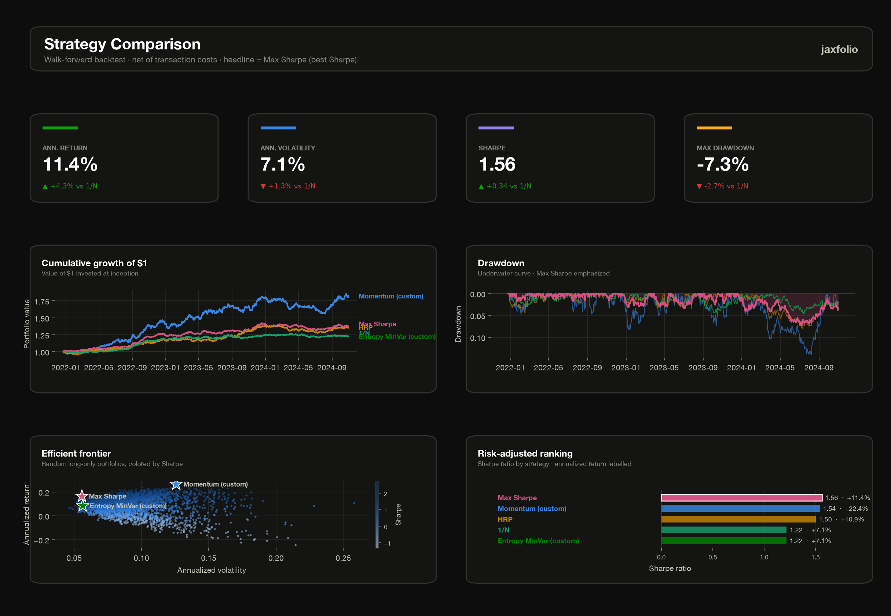

# Custom strategies

A custom strategy in jaxfolio is a first-class citizen: once written, it works
**everywhere the built-ins do** — the [backtester](backtesting.md),
[`compare`](../reference/backtest.md), the [registry](#the-registry), and every
[plot](visualization.md). There are three ways to author one, in increasing
order of control.

## Mode 1 — a weight function

The common case: write a function that maps returns to a weight vector (or a
`{asset: weight}` mapping) and wrap it with
[`custom_strategy`](../reference/toolkit.md#jaxfolio.custom.custom_strategy).
Weights are validated, optionally renormalized to sum to one, and annualized
diagnostics are attached automatically.

```python
import numpy as np
import jaxfolio as jf
from jaxfolio.custom import custom_strategy

def momentum_weights(returns):
    """Weight proportional to trailing cumulative return, clipped at zero."""
    cum = (1.0 + returns).prod() - 1.0
    return np.clip(cum.to_numpy(), 0.0, None)

momentum = custom_strategy(
    "momentum",
    momentum_weights,
    register=True,
    description="Long-only momentum tilt",
)

momentum(returns)          # a full PortfolioResult, like any built-in
```

The weight function may return a NumPy/JAX array aligned to the columns, or a
`{asset: weight}` dict — anything missing is treated as zero weight.

## Mode 2 — a JAX objective

To get constrained optimization *for free*, supply a differentiable objective and
let the shared [projected-gradient solver](../getting-started/concepts.md#the-shared-solver)
minimize it under the configured constraints — exactly how the built-in classical
optimizers are built.

```python
import jax.numpy as jnp
from jaxfolio.custom import CustomStrategy

def entropy_minvar(w, ctx):
    """Minimum variance minus an entropy bonus (encourages diversification)."""
    variance = w @ ctx.cov @ w
    entropy  = -jnp.sum(w * jnp.log(w + 1e-9))
    return variance - 0.002 * entropy

entropy_strategy = CustomStrategy.from_objective(
    "entropy_minvar",
    entropy_minvar,
    register=True,
    description="Entropy-regularized min variance",
)
```

The objective `objective_fn(w, ctx)` must be JAX-differentiable and return a
**scalar to minimize**. `ctx` is a moment context exposing everything the
built-ins use:

| `ctx` attribute | Meaning |
|---|---|
| `ctx.mu` | mean returns, \(\mu\) |
| `ctx.cov` | covariance, \(\Sigma\) |
| `ctx.returns` | the raw \(T \times N\) return matrix |
| `ctx.assets` | asset names |
| `ctx.n` | number of assets |

Pass a [`config`](../reference/types.md#jaxfolio.types.OptimizerConfig) to
`from_objective` to control the constraint set (long-only, weight bounds) and
solver settings.

## Mode 3 — the toolkit, by hand

For full control, assemble a strategy from the public building blocks in
[`jaxfolio.toolkit`](../reference/toolkit.md) — the *stable, documented surface*
that the built-ins themselves use. Everything an optimizer needs is re-exported
here, so a hand-written strategy reads exactly like a built-in one:

```python
from jaxfolio import toolkit as tk

def my_strategy(returns):
    mu, cov, names, _ = tk.moments(returns)
    projection = tk.make_projection(long_only=True, weight_bounds=(0.0, 1.0))

    def objective(w):
        return w @ cov @ w - 0.1 * (w @ mu)      # min-variance with a return tilt

    w, _info = tk.solve_projected_gradient(objective, tk.equal_start(len(names)), projection)
    return tk.finalize_result(w, names, "My Strategy", mu=mu, cov=cov)
```

The toolkit exposes moment estimators (`moments`, `sample_covariance`,
`ewma_covariance`, `ledoit_wolf_covariance`, …), the projections
(`make_projection`, `project_simplex`, `project_box_budget`), the solver core
(`solve_projected_gradient`, `equal_start`), portfolio math (`portfolio_return`,
`portfolio_variance`, `sharpe_ratio`), and — crucially —
[`finalize_result`](../reference/toolkit.md), which computes the annualized
diagnostics. Because your result goes through the *same* `finalize_result` as the
built-ins, it is indistinguishable from them downstream.

## The registry

Registering a strategy makes it discoverable and mixable by name. Any of the
authoring modes above register with `register=True`; you can also use the
decorator form directly on an optimizer-shaped function:

```python
from jaxfolio import register_strategy, get_strategy, list_strategies

@register_strategy("my_momentum", description="12-1 momentum tilt")
def my_momentum(returns):
    ...

list_strategies()                    # built-ins + your additions
list_strategies(custom_only=True)    # just yours
get_strategy("my_momentum")(returns) # look up and run by name
```

Re-registering a name raises unless `overwrite=True`;
[`unregister`](../reference/types.md#jaxfolio.registry.unregister) removes one.

## Putting it together

Custom strategies drop straight into `compare` and the dashboard alongside the
built-ins:

```python
from jaxfolio.backtest import compare, metrics_table

results = compare(returns, {
    "Momentum (custom)":       momentum,
    "Entropy MinVar (custom)": entropy_strategy,
    "Max Sharpe":              jf.maximum_sharpe,
    "HRP":                     jf.hierarchical_risk_parity,
    "1/N":                     jf.equal_weight,
}, lookback=252, rebalance_every=21)

print(metrics_table(results).round(3))
```

<figure markdown>
  
  <figcaption>Two custom strategies benchmarked against the built-ins.</figcaption>
</figure>
