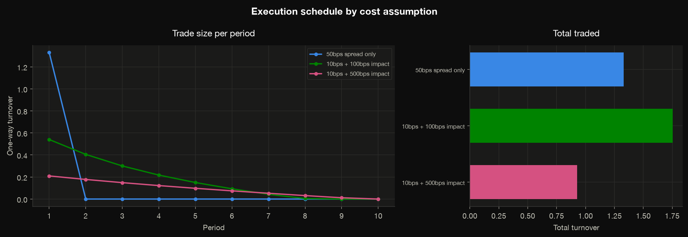
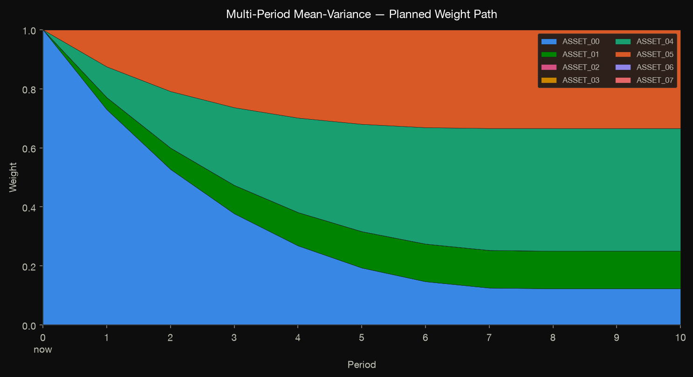
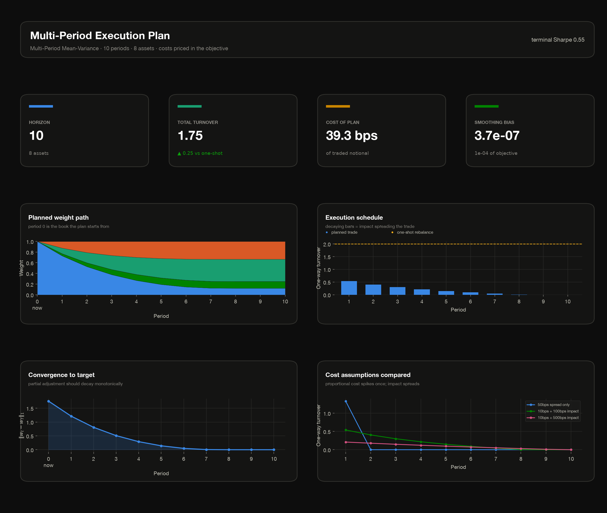

# Multi-period optimization

Every other optimizer in jaxfolio is **single-period**. It collapses the return
panel to \((\mu, \Sigma)\), emits one target weight vector, and knows nothing
about what you currently hold. Transaction costs are then subtracted *afterwards*
by the backtester, against a target that was chosen while blind to them.

The consequence is familiar: the optimizer says *"sell half your largest position
today"*, because nothing in its objective knows that trade is expensive.

`multi_period_mean_variance` answers a different and more actionable question —
not "what should I hold?" but **"what should I do today?"** — by solving for the
whole weight path at once, with costs priced inside the objective.

## The problem

The variable is a \((T, N)\) matrix \(W\) whose row \(t\) is the portfolio to hold
in period \(t\), anchored at the portfolio you hold now, \(w_0 \equiv w_{\text{prev}}\):

$$
\min_{W} \; \sum_{t=1}^{T} \Big[
\underbrace{-w_t^\top \mu_t + \tfrac{\gamma}{2}\, w_t^\top \Sigma_t w_t}_{\text{mean-variance, per period}}
+ \underbrace{c_{\text{lin}}^\top \lvert w_t - w_{t-1} \rvert}_{\text{spread + fees}}
+ \underbrace{c_{\text{quad}}^\top (w_t - w_{t-1})^2}_{\text{market impact}}
\Big]
$$

subject to every period independently satisfying the budget and bound constraints,
\(\{w_t : \ell \le w_t \le u,\ \sum_i w_{t,i} = 1\}\).

## The one thing to understand about costs

**Linear costs alone will not produce a glide path.** This surprises people, so it
is worth being precise: a proportional cost creates a *no-trade region* — a band
within which rebalancing is not worth the fee — but it gives no reason to *split* a
trade, because moving from \(a\) to \(b\) in one step costs exactly the same as
moving there in five. The optimum is to jump once to the cost-adjusted target and
then hold.

Only **quadratic market impact** rewards spreading execution, because two
half-sized trades cost half as much as one double-sized trade. That term is what
turns the solution into a trajectory.

Both behaviors below are the exact optimum, confirmed against a CVXPY QP:

| Costs | Planned turnover per period |
|---|---|
| 50 bps linear only | `0.442, 0.000, 0.000, 0.000, 0.000` |
| 10 bps linear + 500 bps impact | `0.125, 0.092, 0.060, 0.030, 0.004` |



So: if you want execution scheduling, **set `impact_bps`**. If you only set
`spread_bps`, you are asking for a turnover-penalized single-period portfolio, and
that is what you will correctly get.

Unwinding a 100% single-name position over ten periods at 10 bps spread and
100 bps impact looks like this — the position bleeds down smoothly and the plan
flattens as it converges, instead of gapping to the target on day one:



## The cost model

[`TradingCosts`](../reference/types.md#jaxfolio.types.TradingCosts) collects the
frictions. All three coefficients are quoted in **basis points of traded notional
per unit of \(\lvert \Delta w \rvert\), one-way, per period** — the units a trader
states them in — and each accepts a scalar or a per-asset sequence.

| Field | Meaning |
|---|---|
| `spread_bps` | Bid-ask **half**-spread, linear in \(\lvert \Delta w \rvert\). A round trip costs `2 * spread_bps`. |
| `commission_bps` | Proportional fee, also linear. Separate from the spread only for reporting. |
| `impact_bps` | Quadratic impact, per unit \((\Delta w)^2\). **This is the term that spreads execution.** |
| `turnover_penalty` | Extra L1 penalty in decimal units, for soft turnover control that is not a real cash cost. |
| `smoothing` | Numerical tuning knob — see [accuracy](#accuracy) below. |

Costs are **per period** and never annualized: the objective trades them against
per-period \(\mu\) and \(\Sigma\), so annualizing would double-count.

## Usage

```python
import jaxfolio as jf

returns = jf.generate_returns(n_assets=8, n_days=500, seed=42)
holdings = ...  # what you hold right now, aligned with jf.asset_columns(returns)

res = jf.multi_period_mean_variance(
    returns,
    horizon=5,
    w_prev=holdings,
    risk_aversion=3.0,
    costs=jf.TradingCosts(spread_bps=10.0, impact_bps=500.0),
)

res.weights                       # row 0 — trade into this today
res.trajectory                    # the full (5, 8) plan
res.metadata["turnover_path"]     # planned trade size per period
res.metadata["total_cost"]        # cost of executing the whole plan
res.metadata["terminal_weights"]  # the long-run target it is gliding toward
```

`res.weights` is the **first** row, not the last. That is what you act on, and it
is what the backtester trades to. Under binding costs it sits close to
`w_prev`, so `res.sharpe` describes your *near-term* holding and will look worse
than a myopic single-period result — that is the honest reading, not a regression.
For an apples-to-apples comparison use `metadata["terminal_sharpe"]`.

`w_prev` defaults to a flat (all-zero) book, which correctly prices the cost of
*establishing* a position. It need not sum to one.

### A changing forecast

By default one \((\mu, \Sigma)\) from the panel is held across the horizon, so the
trajectory is driven purely by costs. Pass a term structure to express a forecast
that changes over the horizon:

```python
res = jf.multi_period_mean_variance(
    returns, horizon=5, w_prev=holdings,
    mu_path=mu_t,     # (5, N)
    cov_path=cov_t,   # (5, N, N) — omit to reuse the sample covariance
)
```

## Backtesting a path-aware strategy

The backtester supports these strategies through two additions, both of which are
inert for every existing optimizer:

* **Holdings injection.** An optimizer that declares a `w_prev` keyword is handed
  the live portfolio at each rebalance. Detection is by signature, so a plain
  reference or a `functools.partial` both work.
* **Trajectory execution.** A returned `trajectory` is executed step by step over
  the following periods, paying cost on each step, instead of having every row but
  the first discarded. Disable with `follow_trajectory=False` to get the
  comparison arm.

```python
from functools import partial
from jaxfolio.backtest import compare, metrics_table

results = compare(
    returns,
    {
        "myopic": partial(jf.mean_variance, risk_aversion=3.0),
        "multi-period": partial(
            jf.multi_period_mean_variance,
            horizon=5, risk_aversion=3.0,
            costs=jf.TradingCosts(spread_bps=50.0, impact_bps=500.0),
        ),
    },
    lookback=252, rebalance_every=21, transaction_cost=0.005,
)
metrics_table(results)[["annual_return", "sharpe", "avg_turnover", "total_cost"]]
```

`examples/06_multiperiod_costs.py` runs exactly this, and
`examples/notebooks/multiperiod.ipynb` is the same story in notebook form.

!!! warning "A `lambda` hides the parameter"
    Holdings detection reads the signature, and `lambda w: opt(w, w_prev=...)` has
    the signature `(w)`. Such a wrapper silently falls back to legacy behavior —
    which is the safe direction, but not what you wanted. Use `functools.partial`,
    pass the function directly, or force it with `holdings_aware=True`.

Two reporting notes. `turnover` is now indexed by *trading* period rather than
rebalance (identical for path-less optimizers). And realized backtest turnover will
not equal `metadata["turnover_path"]`, because the plan assumes no drift whereas
the engine lets weights drift with returns and then trades from the drifted book.

## Visualizing a plan

Five dedicated plots read a trajectory and its diagnostics directly — they label
integer periods rather than dates, and anchor period 0 at the book the plan starts
from. See the [visualization guide](visualization.md#multi-period-plots).

```python
from jaxfolio import viz

viz.plot_weight_path(res)                 # the trajectory
viz.plot_turnover_schedule(res)           # trade size per period + cumulative
viz.plot_path_convergence(res)            # distance to target; flags a short horizon
viz.plot_cost_comparison({...})           # schedules across cost assumptions
viz.multiperiod_dashboard(res)            # one-page report
```

Pass `reference_weights=` (the myopic optimum) to the schedule plot or the
dashboard to see what the plan saves against a single rebalance. Without it no
"one-shot" reference is drawn, deliberately: a monotone path's total turnover
equals `|w_T - w_prev|` identically, so using the plan's own terminal weights
would look like a comparison while measuring nothing.



## Limitation: turnover caps are soft

Costs are **priced, not capped**. You can make turnover expensive; you cannot
guarantee a turnover budget.

This is structural rather than an oversight. A hard cap
\(\sum_t \lvert w_t - w_{t-1} \rvert \le \tau\) couples the periods, so the
feasible set stops being a product of per-period sets — which is exactly the
property that makes the projection a cheap row-wise operation. An exact projection
onto \(\{\text{box} \cap \text{budget} \cap L_1\text{-ball}\}\) would need Dykstra
or ADMM: a second solver with its own tuning and stopping rule, reusing none of the
existing machinery.

If you have a genuine compliance limit, raise `spread_bps` / `turnover_penalty`
until `metadata["total_turnover"]` sits under it, and verify per rebalance. Do not
represent the result as a guaranteed cap.

## Accuracy

The \(L_1\) trade cost is non-differentiable exactly where the optimum sits — at
zero trade, for every asset that should not move. Applied directly, a first-order
method stalls around 1% above the true optimum regardless of solver family; this is
the same failure mode that limits `min_cvar`.

The optimizer therefore Huber-smooths the term. Because accuracy turns out **not**
to be monotone in the smoothing width, it walks a ladder of shrinking widths and
keeps whichever iterate scores best under the exact, un-smoothed objective.
Measured against a tightly converged CVXPY QP across 4–50 assets and six cost
regimes, that selection takes the worst-case relative gap from **8–160%** down to
**2e-4**, with a typical gap near 1e-6. Frictionless and impact-dominated problems
land at ~1e-8; the stiff case is a mid-range linear cost, where the \(L_1\) term
rivals the entire mean-variance curvature.

Diagnostics that let you audit this per solve:

| Key | Meaning |
|---|---|
| `smoothing_bias` | `objective_exact - objective_smoothed`, i.e. how much the Huber band understated the true cost. Non-negative. |
| `selected_stage` | Which ladder rung won. `-1` means the no-trade path was never beaten, which is *correct* under high costs. |
| `stage_objective_exact` | The exact objective at every rung, so the selection is inspectable. |
| `residual` / `converged` | Projected-gradient norm at the chosen iterate. |

!!! note "`converged: False` is not necessarily a failure"
    When the linear cost is large relative to the smoothing width, the residual
    legitimately plateaus far above `tol` while the answer is exactly right — the
    correct action is "do not trade", and the residual is carrying the un-actioned
    cost gradient. Judge the solve on `smoothing_bias` and the objective, not on
    this flag alone.

## Performance

One compilation is spent per distinct `(horizon, n_assets)` pair, because the
horizon is baked into the variable's shape. Sweeping costs or `risk_aversion` is
free — every cost travels as a traced parameter — but varying `horizon` per
rebalance in a backtest recompiles each time.

The ladder self-adapts to difficulty: an impact-dominated problem converges in a
few dozen iterations, while a stiff linear-cost problem may spend tens of thousands.
