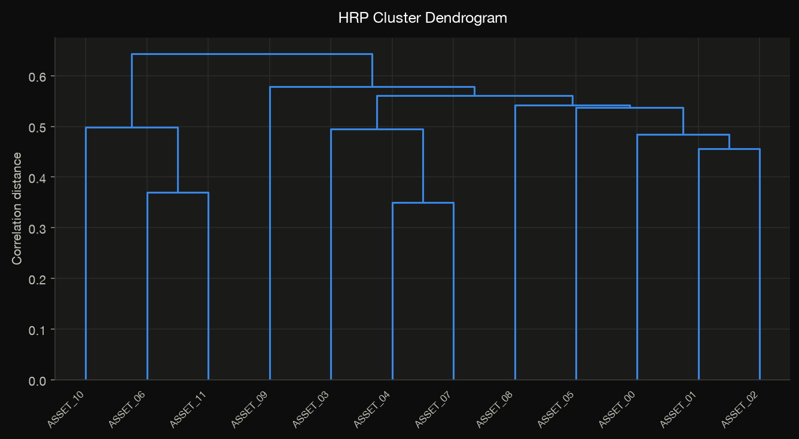

# Optimizers

Every optimizer shares the interface `method(returns, ...) → PortfolioResult`
and — for the constrained classical methods — the same
[projected-gradient solver](../getting-started/concepts.md#the-shared-solver).
This guide states each method's objective, its parameters, and the diagnostics it
records, grouped into four families.

Throughout, \(w \in \mathbb{R}^N\) is the weight vector, \(\mu\) the vector of
expected (per-period) returns, and \(\Sigma\) the return covariance matrix. Unless
noted, the feasible set is the long-only simplex \(\{w : w \ge 0,\ \sum_i w_i = 1\}\),
configurable through [`OptimizerConfig`](../reference/types.md#jaxfolio.types.OptimizerConfig).

!!! abstract "The catalog"
    | Family | Methods |
    |---|---|
    | Baselines | `equal_weight`, `inverse_volatility` |
    | Classical (solver) | `minimum_variance`, `mean_variance`, `maximum_sharpe`, `maximum_diversification`, `risk_parity`, `kelly`, `min_cvar`, `black_litterman` |
    | Learning | `deep_sharpe`, `online_gradient` |
    | Graph | `hierarchical_risk_parity`, `hierarchical_equal_risk`, `mst_centrality` |

---

## Baselines

Cheap, closed-form weightings that are famously hard to beat and make honest
benchmarks in any comparison.

### `equal_weight`

The \(1/N\) portfolio: \(w_i = 1/N\). No estimation, no error — the reference
every other method must justify beating.

```python
jf.equal_weight(returns)
```

### `inverse_volatility`

Naive risk parity — weight inversely to each asset's own volatility, ignoring
correlations:

$$
w_i \propto \frac{1}{\sqrt{\Sigma_{ii}}}, \qquad \sum_i w_i = 1.
$$

```python
jf.inverse_volatility(returns)
```

---

## Classical optimizers

These minimize a differentiable objective under the configured constraints with
the shared solver. Each accepts an optional `config: OptimizerConfig`.

### `minimum_variance`

The global minimum-variance portfolio:

$$
\min_{w \in \mathcal{C}}\; w^\top \Sigma\, w \;+\; \lambda_{2}\lVert w \rVert_2^2 .
$$

The optional \(\ell_2\) term (`config.l2_reg`) discourages concentration.

```python
jf.minimum_variance(returns)
```

### `mean_variance`

Markowitz mean–variance utility with risk-aversion \(\gamma\):

$$
\max_{w \in \mathcal{C}}\; w^\top \mu \;-\; \tfrac{\gamma}{2}\, w^\top \Sigma\, w .
$$

Larger `risk_aversion` tilts toward lower variance.

```python
jf.mean_variance(returns, risk_aversion=1.0)
```

### `maximum_sharpe`

The tangency portfolio — maximum Sharpe ratio:

$$
\max_{w \in \mathcal{C}}\; \frac{w^\top \mu - r_f}{\sqrt{w^\top \Sigma\, w}} .
$$

The Sharpe ratio is scale-invariant, so the problem is optimized directly on the
simplex. `config.risk_free_rate` sets the per-period \(r_f\).

```python
jf.maximum_sharpe(returns)
```

### `maximum_diversification`

Maximizes the **diversification ratio** (Choueifaty &amp; Coignard, 2008) — the
ratio of the weighted-average asset volatility to the portfolio volatility:

$$
\max_{w \in \mathcal{C}}\; \frac{w^\top \sigma}{\sqrt{w^\top \Sigma\, w}},
\qquad \sigma_i = \sqrt{\Sigma_{ii}} .
$$

```python
jf.maximum_diversification(returns)
```

### `risk_parity`

The equal-risk-contribution (ERC) portfolio: each asset contributes equally to
total portfolio risk. Solved with the cyclical coordinate descent of
Griveau-Billion, Richard &amp; Roncalli (2013) on the convex program

$$
\min_{x > 0}\; \tfrac12\, x^\top \Sigma\, x - \frac{1}{N}\sum_i \log x_i,
$$

whose normalized fixed point \(w = x / \sum_i x_i\) equalizes the risk
contributions \(w_i (\Sigma w)_i\). Each coordinate update is a one-dimensional
quadratic solved in closed form, keeping \(x_i\) strictly positive and converging
regardless of covariance scale.

```python
result = jf.risk_parity(returns)
result.metadata["risk_contributions"]   # per-asset, equalized at 1/N
```

The realized risk contributions are stored in `metadata` — plot them with
[`plot_risk_contributions`](visualization.md).

### `kelly`

The growth-optimal (log-wealth) portfolio, maximizing expected log-growth over
the sample paths:

$$
\max_{w \in \mathcal{C}}\; \frac{1}{T}\sum_{t=1}^{T} \log\!\bigl(1 + w^\top r_t\bigr) .
$$

Optimized over the return matrix directly (not just its moments).

```python
jf.kelly(returns)
```

### `min_cvar`

Minimum Conditional-Value-at-Risk (Rockafellar &amp; Uryasev, 2000). Using the
auxiliary-variable formulation, weights \(w\) and the VaR threshold \(\tau\) are
optimized *jointly*:

$$
\min_{w \in \mathcal{C},\, \tau}\;
\tau + \frac{1}{(1-\alpha)\,T} \sum_{t=1}^{T}\bigl[\,\ell_t - \tau\,\bigr]_+,
\qquad \ell_t = -\,w^\top r_t .
$$

```python
result = jf.min_cvar(returns, alpha=0.95)
result.metadata["cvar"], result.metadata["var"]
```

### `black_litterman`

Blends the market-implied equilibrium with your own views. Reverse optimization
gives the equilibrium (prior) excess returns \(\pi = \gamma\,\Sigma\, w_{\text{mkt}}\);
absolute views \(P w = q\) with uncertainty \(\Omega\) yield the He &amp; Litterman
posterior mean

$$
\bar\mu = \bigl[(\tau\Sigma)^{-1} + P^\top \Omega^{-1} P\bigr]^{-1}
          \bigl[(\tau\Sigma)^{-1}\pi + P^\top \Omega^{-1} q\bigr],
$$

which is then mean–variance optimized. With no views, the result reduces to the
equilibrium (market) portfolio.

```python
result = jf.black_litterman(
    returns,
    views={"ASSET_00": 0.02, "ASSET_03": -0.01},   # absolute per-period views
    view_confidence=0.5,                            # (0, 1] — higher = tighter
    tau=0.05,
    risk_aversion=2.5,
)
result.metadata["posterior_returns"]
```

!!! tip "LLM-generated views"
    `black_litterman` is the engine behind the [LLM strategies](llm.md): a local
    model produces the `views` and a dispersion-calibrated `view_confidence`.

---

## Learning-based

Differentiable and online methods — the ones that only exist because the whole
pipeline is JAX.

### `deep_sharpe`

An end-to-end differentiable allocation **policy**. A small MLP maps the flattened
trailing `lookback` window of returns to long-only weights (via softmax), trained
by gradient ascent to maximize the annualized Sharpe of the strategy's realized
returns across all windows. Pure JAX + optax — no `flax` dependency. The reported
allocation is the policy applied to the most recent window; the trained parameters
are retained in `metadata` so the policy can be rolled forward.

$$
\max_{\theta}\;\; \sqrt{P}\cdot
\frac{\operatorname{mean}_t \, r^{\text{strat}}_t(\theta)}
     {\operatorname{std}_t \, r^{\text{strat}}_t(\theta)},
\qquad
w_t(\theta) = \operatorname{softmax}\bigl(\text{MLP}_\theta(\text{window}_t)\bigr).
$$

```python
result = jf.deep_sharpe(returns, lookback=60, hidden=(64, 32), epochs=300, seed=0)
result.metadata["final_train_sharpe"], result.metadata["params"]
```

### `online_gradient`

The exponentiated-gradient (EG) universal online portfolio (Helmbold et al.).
Weights update multiplicatively by realized returns, achieving sub-linear regret
versus the best constant-rebalanced portfolio in hindsight:

$$
w_{t+1,i} \;\propto\; w_{t,i}\, \exp\!\left(\eta\, \frac{r_{t,i}}{w_t^\top r_t}\right).
$$

```python
result = jf.online_gradient(returns, eta=0.05)
result.metadata["final_wealth"], result.metadata["wealth_path"]
```

---

## Graph-based

Hierarchy- and network-based allocation. These are combinatorial (SciPy linkage /
MST) rather than gradient-based.

### `hierarchical_risk_parity`

López de Prado's HRP (2016). Cluster assets by the correlation-distance
\(d_{ij} = \sqrt{\tfrac12 (1 - \rho_{ij})}\) dendrogram, quasi-diagonalize the
covariance by the leaf order, then recursively bisect and split capital by inverse
cluster variance. Robust to the ill-conditioned covariances that break classical
mean–variance.

```python
result = jf.hierarchical_risk_parity(returns, linkage_method="single")
result.metadata["linkage"]   # feeds plot_dendrogram
```

<figure markdown>
  
  <figcaption>The HRP linkage tree via <code>viz.plot_dendrogram</code>.</figcaption>
</figure>

### `hierarchical_equal_risk`

HERC — cut the dendrogram into `n_clusters` groups, allocate across clusters by
inverse cluster variance and within each cluster by inverse variance. A more
robust, less order-sensitive cousin of HRP.

```python
jf.hierarchical_equal_risk(returns, n_clusters=4, linkage_method="ward")
```

### `mst_centrality`

Build the minimum spanning tree of the correlation-distance network; assets with
lower degree centrality (more peripheral, less coupled to the market core) receive
more weight:

$$
w_i \;\propto\; \frac{1}{(\deg_i)^{\alpha}} .
$$

Eigenvector centrality and the MST adjacency are recorded in `metadata` for the
[correlation-network plot](visualization.md).

```python
jf.mst_centrality(returns, alpha=1.0)
```

---

## Choosing a method

| If you want… | Consider |
|---|---|
| An honest benchmark | `equal_weight`, `inverse_volatility` |
| Lowest risk | `minimum_variance`, `risk_parity` |
| Best risk-adjusted return | `maximum_sharpe`, `mean_variance` |
| Tail-risk control | `min_cvar` |
| To express a subjective view | `black_litterman` |
| Robustness to noisy covariances | `hierarchical_risk_parity`, `hierarchical_equal_risk` |
| Growth maximization | `kelly` |
| A learned, adaptive policy | `deep_sharpe`, `online_gradient` |

Then compare them fairly with a [walk-forward backtest](backtesting.md) — the
in-sample optimum is rarely the out-of-sample winner.
