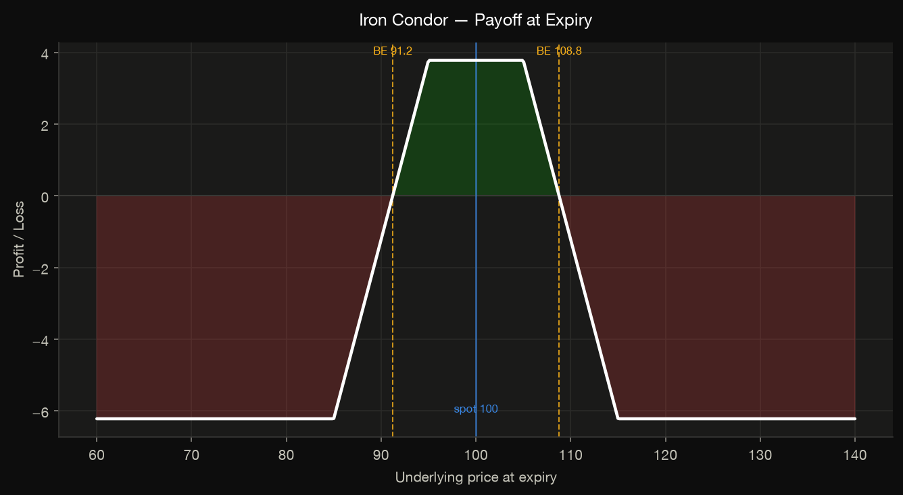

# Options

The options toolkit is built on one idea: **the Black–Scholes price is a plain
differentiable JAX function, so every Greek is an autodiff derivative of it.**
There are no hand-coded Greek formulas to drift out of sync with the pricer, and
the same `vmap` that prices a chain also differentiates it.

## Pricing

[`black_scholes_price`](../reference/options.md#jaxfolio.options.pricing.black_scholes_price)
prices a European option. Every array argument broadcasts, so it prices whole
chains at once. The convention is a boolean `is_call`.

```python
from jaxfolio.options import black_scholes_price

# ATM 3-month call, 20% vol, 3% rate
price = float(black_scholes_price(spot=100.0, strike=100.0, ttm=0.25,
                                  vol=0.20, rate=0.03, is_call=True))
```

| Argument | Meaning |
|---|---|
| `spot`, `strike` | underlying price and strike |
| `ttm` | time to maturity, in years |
| `vol` | annualized volatility |
| `rate`, `div` | continuous risk-free rate and dividend yield |
| `is_call` | `True` for a call, `False` for a put |

For American-style options,
[`binomial_american`](../reference/options.md#jaxfolio.options.pricing.binomial_american)
runs a Cox–Ross–Rubinstein lattice with early-exercise checks at every node
(`steps` controls resolution).

### Implied volatility

[`implied_volatility`](../reference/options.md#jaxfolio.options.pricing.implied_volatility)
recovers vol from a market price via **jitted Newton iterations** — and the vega
in the Newton step is itself `jax.grad` of the pricer, so no derivative is
hand-written:

```python
from jaxfolio.options import implied_volatility

iv = float(implied_volatility(price, spot=100.0, strike=100.0, ttm=0.25, rate=0.03))
# ≈ 0.20 — recovers the vol that produced `price`
```

## Greeks via autodiff

[`all_greeks`](../reference/options.md#jaxfolio.options.greeks.all_greeks) returns
every first- and second-order sensitivity for a single option:

```python
from jaxfolio.options import all_greeks

all_greeks(100, 100, 0.25, 0.20, 0.03)
# {'price': ..., 'delta': ..., 'gamma': ..., 'vega': ..., 'theta': ..., 'rho': ...}
```

Each is the derivative of the price:

| Greek | Definition |
|---|---|
| delta | \(\partial \text{price} / \partial \text{spot}\) |
| gamma | \(\partial^2 \text{price} / \partial \text{spot}^2\) |
| vega | \(\partial \text{price} / \partial \text{vol}\) |
| theta | \(-\,\partial \text{price} / \partial \text{ttm}\) (per year) |
| rho | \(\partial \text{price} / \partial \text{rate}\) |

[`chain_greeks`](../reference/options.md#jaxfolio.options.greeks.chain_greeks)
returns every Greek across a whole chain in one `vmap`-ed call, aligned to the
input `(strike, ttm, vol)` triples.

## Multi-leg strategies

An [`OptionLeg`](../reference/options.md#jaxfolio.options.strategies.OptionLeg) is
a single position (kind, strike, signed quantity, expiry, premium); an
[`OptionStrategy`](../reference/options.md#jaxfolio.options.strategies.OptionStrategy)
is a collection of legs, optionally with a `StockLeg`. Preset constructors build
the common structures and fill each leg's premium from Black–Scholes, so payoff
diagrams reflect realistic entry costs.

```python
from jaxfolio.options import iron_condor, straddle, collar

condor = iron_condor(spot=100, put_long=85, put_short=95,
                     call_short=105, call_long=115, expiry=0.25, vol=0.22)

condor.net_premium()                 # + credit / − debit
condor.greeks(spot=100, vol=0.22)    # net delta / gamma / vega / theta / rho
condor.break_evens()                 # approximate break-even spot(s)
condor.payoff_at_expiry(spot_grid)   # P&L across terminal prices
condor.pnl_at(spot=102, vol=0.22, ttm_shift=1/12)   # mark-to-model at a horizon
```

### Preset builders

| Constructor | Structure |
|---|---|
| `covered_call` | long stock + short call (income, capped upside) |
| `protective_put` | long stock + long put (downside insurance) |
| `collar` | long stock + long put + short call (bounded, often ~zero cost) |
| `bull_call_spread` | long lower call + short upper call (capped bullish debit) |
| `bear_put_spread` | long upper put + short lower put (capped bearish debit) |
| `straddle` | long call + long put, same strike (large-move bet) |
| `strangle` | long OTM put + long OTM call (cheaper vol bet) |
| `iron_condor` | short strangle inside long wings (range-bound credit) |
| `butterfly` | 1 / −2 / 1 calls (peak pinned at the middle strike) |
| `calendar_spread` | short near-dated + long far-dated call (theta/vega) |

!!! warning "Calendar spreads"
    Because a calendar spread's legs have different expiries, analyze it with
    `pnl_at` (mark-to-model) rather than the at-expiry payoff.

## Plotting payoffs and Greeks

```python
from jaxfolio import viz

viz.save(viz.plot_payoff(condor, spot=100), "condor_payoff.png")
viz.save(viz.plot_greeks_profile(condor, spot=100, vol=0.22), "condor_greeks.png")
```

<figure markdown>
  
  <figcaption>Profit shaded green, loss red; break-evens and spot annotated.</figcaption>
</figure>

An implied-volatility surface, given a strike × expiry grid of IVs:

```python
viz.save(viz.plot_vol_surface(spot, strikes, expiries, ivs), "surface.png")
```

## Portfolio overlays

This is where the two halves of the library compose. The
[`overlay`](../reference/options.md) module takes an optimizer's
`PortfolioResult` and wraps the largest holdings in options, then aggregates the
net Greeks and produces a combined payoff.

```python
import jaxfolio as jf
from jaxfolio.options.overlay import collar_overlay, covered_call_overlay
import numpy as np

portfolio = jf.maximum_sharpe(returns)
spots = {a: 100.0 for a in portfolio.assets}

book = collar_overlay(portfolio, spots, top_n=5,
                      put_moneyness=0.95, call_moneyness=1.08,
                      expiry=0.25, vol=0.25)

book.net_greeks()                              # weighted net Greeks of the book
book.payoff_curve(np.linspace(0.7, 1.3, 200))  # weighted P&L across ±30% shocks
```

An [`OverlayBook`](../reference/options.md#jaxfolio.options.overlay.OverlayBook)
holds the per-asset strategies scaled by portfolio weight; `covered_call_overlay`
writes calls for income, `collar_overlay` bounds each holding between the put and
call moneyness. Assets without a provided spot are skipped.

## Volatility surfaces

A [`VolSurface`](../reference/options.md#jaxfolio.options.surface.VolSurface)
turns a discrete grid of implied vols (strikes × expiries) into a smooth,
callable `iv(strike, ttm)` by interpolating **in total variance**. Build one from
market prices — which inverts each quote with the Newton
[`implied_volatility`](../reference/options.md#jaxfolio.options.pricing.implied_volatility)
solver — or fit a parametric **raw-SVI** slice per expiry.

```python
import numpy as np
from jaxfolio.options import VolSurface

strikes = np.array([80, 90, 100, 110, 120.0])
ttms = np.array([0.1, 0.25, 0.5])
iv_grid = np.array([                          # one smile row per expiry
    [0.30, 0.25, 0.22, 0.24, 0.28],
    [0.29, 0.24, 0.21, 0.23, 0.27],
    [0.28, 0.23, 0.205, 0.225, 0.26],
])

surf = VolSurface.from_iv_grid(strikes, ttms, iv_grid, spot=100.0)
surf.iv(105, 0.3)                 # interpolated vol at an off-grid point
surf.price(105, 0.3)             # priced off the surface (reuses Black-Scholes)
surf.greeks(105, 0.3)            # full Greeks at the surface vol

fitted = surf.fit_svi()          # smooth, extrapolating raw-SVI smiles
surf.arbitrage_report()          # butterfly (convexity) + calendar checks
```

`arbitrage_report()` flags **butterfly** violations (call price must be convex in
strike) and **calendar** violations (total variance must not decrease with
maturity), so you can validate a surface before trading off it.

### Discrete dividends & American exercise

[`binomial_american`](../reference/options.md#jaxfolio.options.pricing.binomial_american)
prices American-style options on a Cox–Ross–Rubinstein lattice with early
exercise. It supports both a continuous dividend *yield* (`div=`) and a schedule
of **discrete cash dividends** via the escrowed-dividend model:

```python
from jaxfolio.options import binomial_american

# American put with a $3 cash dividend at 6 months (raises the put value):
binomial_american(100, 100, 1.0, 0.2, rate=0.05, is_call=False,
                  dividends=[(0.5, 3.0)])
```

## Execution framework

!!! note "Research simulation, not live trading"
    This simulates fills against a *modeled* Black–Scholes / surface price with
    transaction costs. It is a backtesting / research tool — **not** a live
    broker, order-management system, or exchange connection. Simulated fills,
    costs, and P&L will differ from live trading. See
    [DISCLAIMER.md](https://github.com/bravant-oss/jaxfolio/blob/main/DISCLAIMER.md).

The `jaxfolio.options.execution` subpackage adds order/fill accounting, a
transaction-[`CostModel`](../reference/options.md#jaxfolio.options.execution.costs.CostModel),
a mark-to-market option book, and an
[`ExecutionSimulator`](../reference/options.md#jaxfolio.options.execution.book.ExecutionSimulator).
It is the options analogue of the walk-forward equity backtester:

```python
import numpy as np
from jaxfolio.options.execution import (
    ExecutionSimulator, Instrument, Order, CostModel,
    simulate_covered_call_roll,
)

# Trade a single option with costs and mark the book to market.
sim = ExecutionSimulator(cost_model=CostModel(commission_per_contract=0.65,
                                              slippage_bps=5.0))
sim.execute(Order(Instrument("call", 105.0, 0.25), -1.0), spot=100.0, vol=0.2)
sim.book.net_greeks(100.0, 0.2)     # net position Greeks
sim.equity(100.0, 0.2)             # cash + mark-to-market book value

# Or roll a covered-call overlay through a whole price path.
path = 100 * np.cumprod(1 + np.random.default_rng(0).normal(0.0005, 0.01, 252))
res = simulate_covered_call_roll(path, moneyness=1.05, tenor=0.25,
                                 roll_every=21, vol=0.2)
res.total_return, res.stock_return, res.total_costs, res.n_rolls
```

`simulate_covered_call_roll` holds the underlying, writes a short call per share,
and rolls it every `roll_every` steps — charging costs at each roll and returning
the overlaid equity path alongside the buy-and-hold benchmark.
