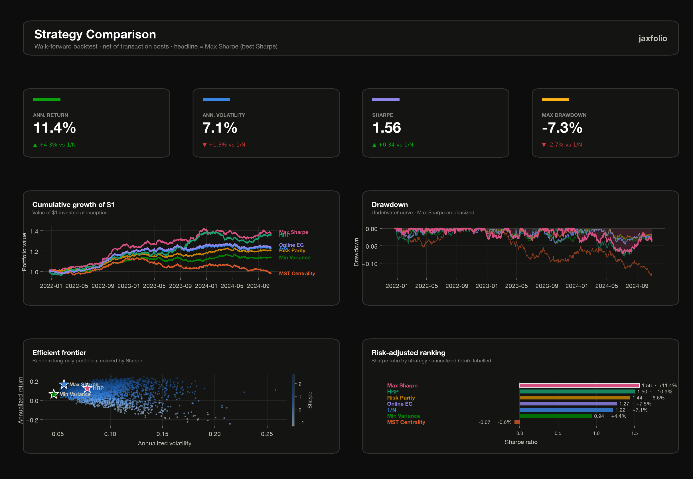
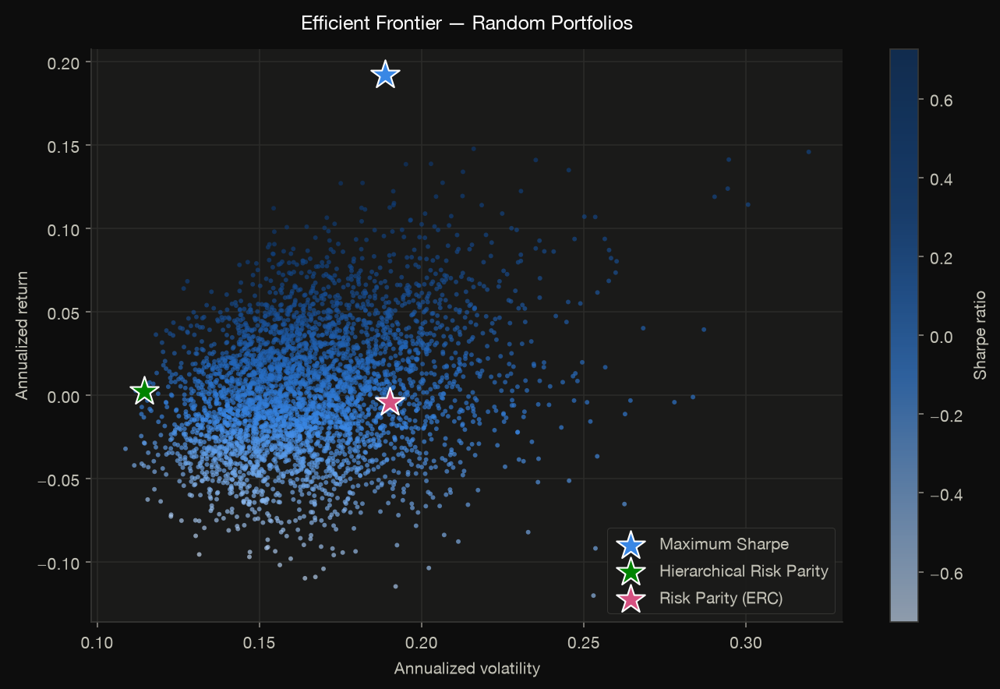
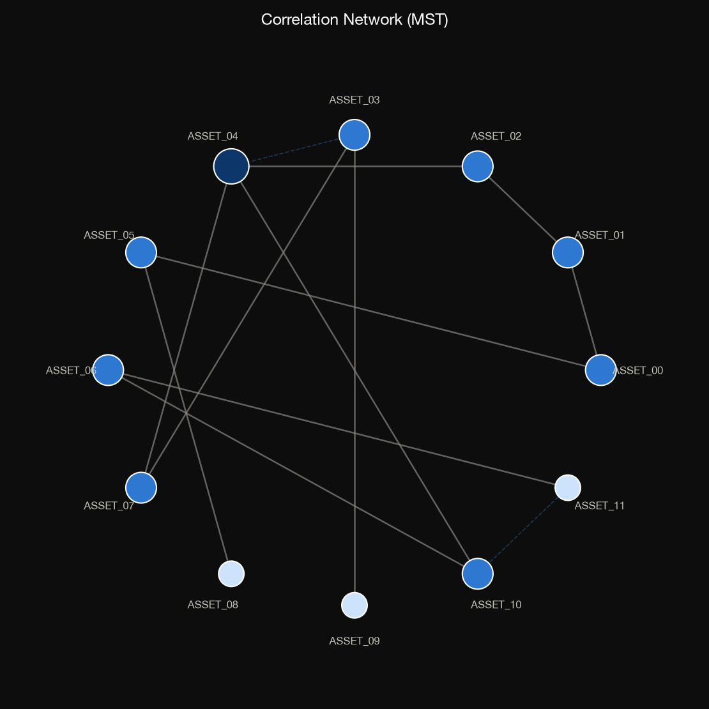

# Visualization

Every plotting function returns a matplotlib `Figure`, so you can save it, embed
it, or customize it further. All plots use a validated, colorblind-considered
**dark theme** — a fixed categorical order, a single-hue blue sequential ramp for
magnitude, and neutral ink/grid tokens tuned for the dark surface. Importing
`jaxfolio.viz` registers the theme globally.

```python
from jaxfolio import viz

fig = viz.plot_weights(result)
viz.save(fig, "weights.png", dpi=150)     # preserves the dark background
```

## The composite dashboard

[`dashboard`](../reference/viz.md#jaxfolio.viz.plots.dashboard) is the headline
report: a KPI strip for the best strategy (by Sharpe), equity curves, drawdown,
the efficient frontier, and a risk-adjusted ranking — laid out on a clean
reporting grid.

```python
fig = viz.dashboard(results, returns, highlight=highlight)
viz.save(fig, "dashboard.png")
```

- `results` — a `{name: BacktestResult}` map from [`compare`](backtesting.md).
- `highlight` — an optional `{name: PortfolioResult}` map overlaid on the frontier.

<figure markdown>
  
</figure>

## Portfolio plots

| Function | Shows |
|---|---|
| [`plot_weights`](../reference/viz.md#jaxfolio.viz.plots.plot_weights) | horizontal bar chart of holdings (largest on top) |
| [`plot_efficient_frontier`](../reference/viz.md#jaxfolio.viz.plots.plot_efficient_frontier) | Monte-Carlo frontier colored by Sharpe, with method markers |
| [`plot_risk_contributions`](../reference/viz.md#jaxfolio.viz.plots.plot_risk_contributions) | per-asset risk contribution (uses ERC metadata) |
| [`plot_weight_evolution`](../reference/viz.md#jaxfolio.viz.plots.plot_weight_evolution) | stacked-area weight history over a backtest |

```python
viz.save(viz.plot_efficient_frontier(returns, highlight=highlight), "frontier.png")
viz.save(viz.plot_risk_contributions(jf.risk_parity(returns)), "risk_contrib.png")
```

<figure markdown>
  
  <figcaption>Random long-only portfolios colored by Sharpe, with method markers overlaid.</figcaption>
</figure>

## Backtest plots

| Function | Shows |
|---|---|
| [`plot_equity_curves`](../reference/viz.md#jaxfolio.viz.plots.plot_equity_curves) | cumulative growth of $1, direct-labeled |
| [`plot_drawdown`](../reference/viz.md#jaxfolio.viz.plots.plot_drawdown) | underwater (drawdown) curves |
| [`plot_metrics_table`](../reference/viz.md#jaxfolio.viz.plots.plot_metrics_table) | a styled metrics comparison table |

```python
viz.save(viz.plot_equity_curves(results), "equity.png")
viz.save(viz.plot_drawdown(results), "drawdown.png")
```

## Structure &amp; correlation plots

| Function | Shows |
|---|---|
| [`plot_correlation_heatmap`](../reference/viz.md#jaxfolio.viz.plots.plot_correlation_heatmap) | clustered correlation matrix (diverging blue↔red) |
| [`plot_correlation_network`](../reference/viz.md#jaxfolio.viz.plots.plot_correlation_network) | MST correlation network, node size = degree |
| [`plot_dendrogram`](../reference/viz.md#jaxfolio.viz.plots.plot_dendrogram) | HRP linkage dendrogram (needs HRP metadata) |

```python
viz.save(viz.plot_correlation_network(returns), "network.png")
viz.save(viz.plot_dendrogram(jf.hierarchical_risk_parity(returns)), "dendrogram.png")
```

<figure markdown>
  
  <figcaption>The minimum-spanning-tree correlation network.</figcaption>
</figure>

## Options plots

| Function | Shows |
|---|---|
| [`plot_payoff`](../reference/viz.md#jaxfolio.viz.plots.plot_payoff) | payoff-at-expiry, profit/loss shaded, break-evens marked |
| [`plot_greeks_profile`](../reference/viz.md#jaxfolio.viz.plots.plot_greeks_profile) | net Greeks vs. spot (delta / gamma / vega / theta) |
| [`plot_vol_surface`](../reference/viz.md#jaxfolio.viz.plots.plot_vol_surface) | implied-volatility surface as a filled contour |

```python
viz.save(viz.plot_payoff(condor, spot=100), "payoff.png")
viz.save(viz.plot_greeks_profile(condor, spot=100, vol=0.22), "greeks.png")
```

## The theme

The palette lives in [`jaxfolio.viz.theme`](../reference/viz.md). To reuse the
categorical colors in your own matplotlib code:

```python
from jaxfolio.viz import theme

theme.color(0)          # first categorical color, applied in fixed order
theme.SEQUENTIAL_CMAP   # single-hue blue ramp for magnitude
theme.DIVERGING_CMAP    # blue↔red for signed magnitude (e.g. correlation)
theme.use_dark_theme()  # (re)register the rcParams
```

!!! tip "Colors carry meaning"
    The status accents (`GOOD`, `WARNING`, `CRITICAL`) are reserved and never
    reused as a series color, and the categorical order is applied in sequence
    rather than cycled arbitrarily — so identity never rests on color alone.
