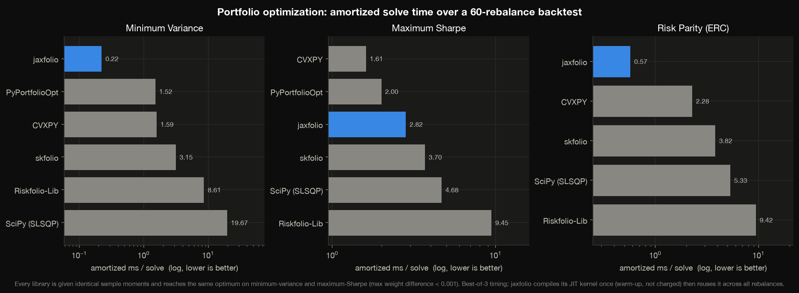

---
hide:
  - toc
---

<div class="jf-hero" markdown>


<h1 class="jf-hero__title">jaxfolio</h1>

<p class="jf-hero__tagline">
Differentiable portfolio optimization &amp; options strategies, powered by JAX.
</p>

<p class="jf-badges">
  
  
  
</p>

[Get started](getting-started/installation.md){ .md-button .md-button--primary }
[View on GitHub](https://github.com/bravant-oss/jaxfolio){ .md-button }

</div>

## Why jaxfolio

Portfolio construction has splintered into many methods — mean–variance, risk
parity, hierarchical clustering, learned policies — and, increasingly, options
overlays layered on top of an equity book. Each is powerful, but in practice they
arrive as **disconnected tools**: a QP solver here, a clustering script there, a
separate options pricer, each with its own inputs, quirks, and no common way to
compare them or hedge across them.

That fragmentation is the real cost. Swapping one strategy for another means
rewriting glue code; comparing them fairly means re-implementing the same
backtest three times; and taking a *gradient through* an allocation — the thing
modern, learning-based methods depend on — is simply impossible when the pieces
do not share a numerical foundation.

**jaxfolio unifies them on a single differentiable core.** Sixteen optimizers —
classical, learning-based, and graph-based — sit behind one interface,
`method(returns) → PortfolioResult`, and every constrained method is the *same*
JIT-compiled projected-gradient solver with a different objective. Because the
whole pipeline (moment estimation → optimization → backtest) is JAX, it is
end-to-end differentiable and fast: you can backtest thousands of rebalances,
differentiate through an optimizer to train an allocation policy, and get exact
option Greeks for an entire chain from the same autodiff that prices it.

<figure markdown>
  
  <figcaption>A walk-forward strategy comparison rendered with <code>viz.dashboard</code>.</figcaption>
</figure>

## What is inside

<div class="jf-grid" markdown>

<div class="jf-card" markdown>
### [Optimizers](guide/optimizers.md)
Sixteen methods — classical, learning, and graph-based — behind one interface.
</div>

<div class="jf-card" markdown>
### [Backtesting](guide/backtesting.md)
A vectorized walk-forward engine with costs, turnover, and a full metric suite.
</div>

<div class="jf-card" markdown>
### [Options](guide/options.md)
Black–Scholes pricing, autodiff Greeks, implied vol, and 10+ multi-leg strategies.
</div>

<div class="jf-card" markdown>
### [LLM strategies](guide/llm.md)
Local-model views routed through Black–Litterman — no API keys, fully offline.
</div>

<div class="jf-card" markdown>
### [Custom strategies](guide/custom-strategies.md)
Register your own method; it works everywhere the built-ins do.
</div>

<div class="jf-card" markdown>
### [Visualization](guide/visualization.md)
Publication-quality dark-themed plots for every stage of the workflow.
</div>

</div>

## Benchmark

Because every constrained optimizer is the *same* cached JIT kernel with a
different objective, a rolling-rebalance backtest compiles once and reuses the
compiled solve at every rebalance. jaxfolio matches the dedicated QP solvers'
optimum while being the fastest on minimum-variance and risk parity — and
competitive on maximum-Sharpe.

<figure markdown>
  
  <figcaption>
    Amortized solve time over a 60-rebalance backtest — jaxfolio vs. PyPortfolioOpt,
    Riskfolio-Lib, skfolio, CVXPY, and SciPy, all fed identical sample moments.
    Reproduce it in <code>examples/benchmark</code>.
  </figcaption>
</figure>

## Quickstart

```python
import jaxfolio as jf
from jaxfolio.backtest import compare
from jaxfolio import viz

returns = jf.generate_returns(n_assets=10, seed=7)      # or load_yfinance / load_csv

results = compare(returns, {
    "Max Sharpe":  jf.maximum_sharpe,
    "HRP":         jf.hierarchical_risk_parity,
    "Risk Parity": jf.risk_parity,
    "1/N":         jf.equal_weight,
})

viz.save(viz.dashboard(results, returns), "dashboard.png")
```

## Capabilities at a glance

| Family | Methods |
|---|---|
| **Traditional** | min-variance · mean-variance · max-Sharpe · max-diversification · risk parity (ERC) · Kelly · min-CVaR · Black–Litterman |
| **Learning** | differentiable MLP Sharpe policy · online exponentiated-gradient |
| **Graph** | hierarchical risk parity (HRP) · HERC · MST centrality |
| **LLM (local)** | LLM → Black–Litterman views · news-sentiment tilt · multi-agent debate |
| **Options** | Black–Scholes pricing · Greeks via autodiff · implied vol · 10+ multi-leg strategies · collar / covered-call overlays |
| **Backtest** | walk-forward engine · costs &amp; turnover · Sharpe / Sortino / Calmar / VaR / CVaR / drawdown |
| **Data** | synthetic GBM · CSV · Parquet · Yahoo Finance · option chains |

!!! tip "New here?"
    Start with [Installation](getting-started/installation.md), then the
    [Quickstart](getting-started/quickstart.md). To understand *how* the pieces
    fit together — the shared solver, `PortfolioResult`, and the moment
    pipeline — read [Core concepts](getting-started/concepts.md).
